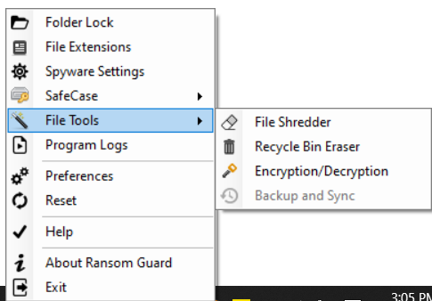
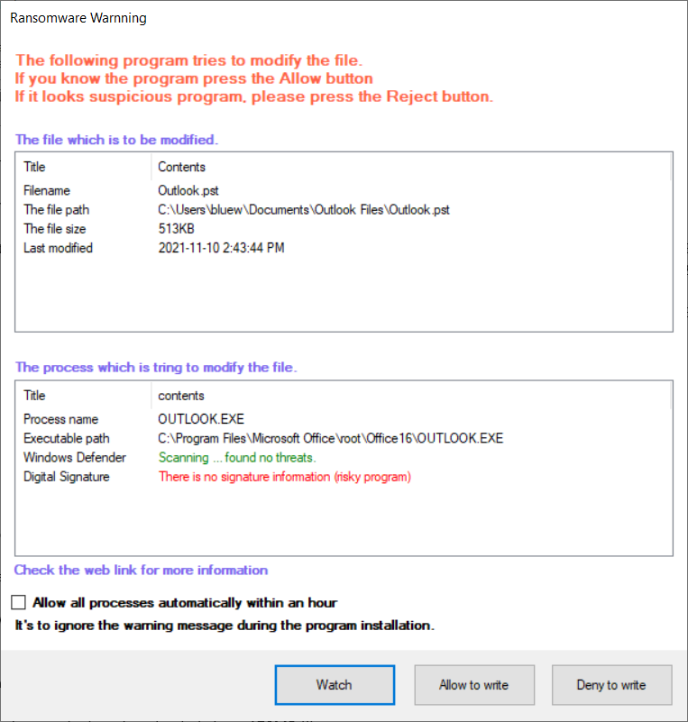
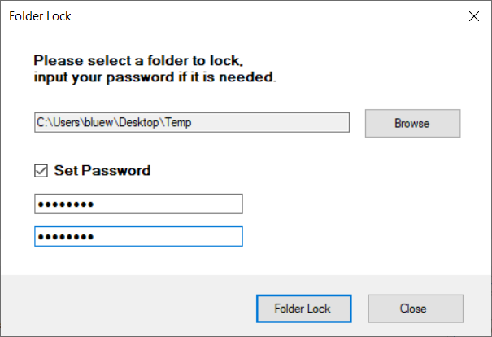
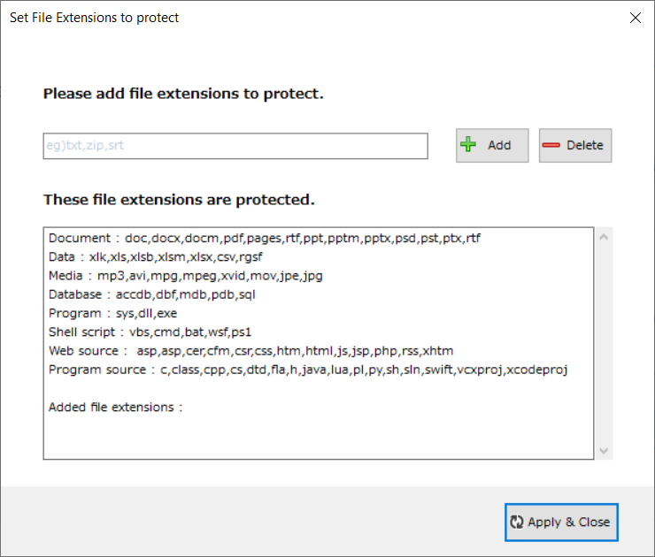
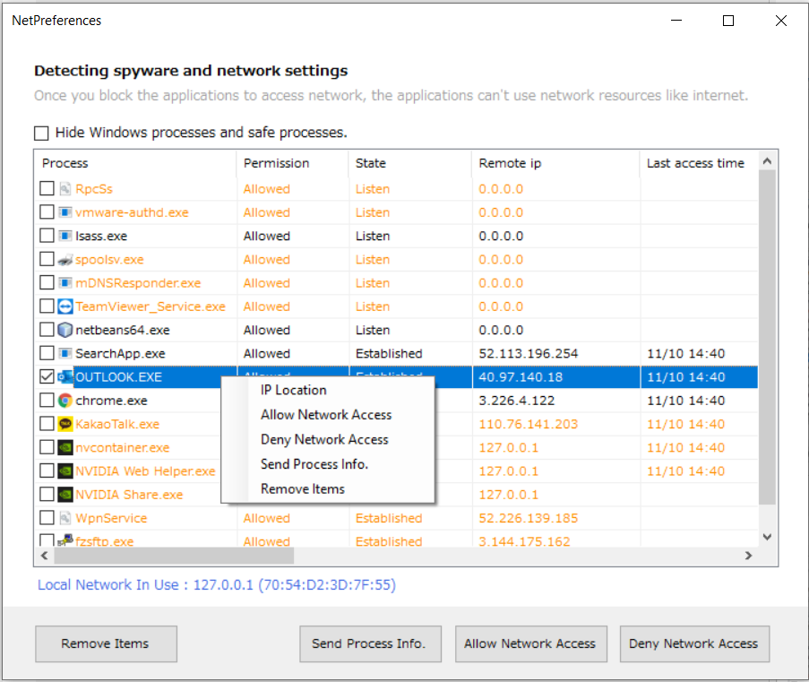
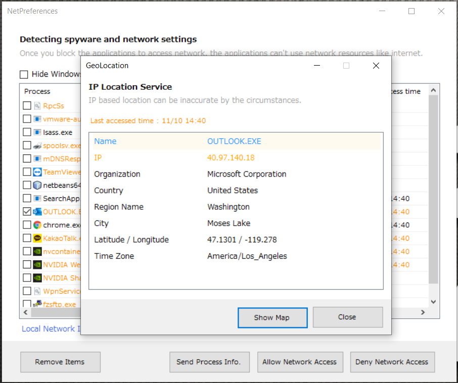
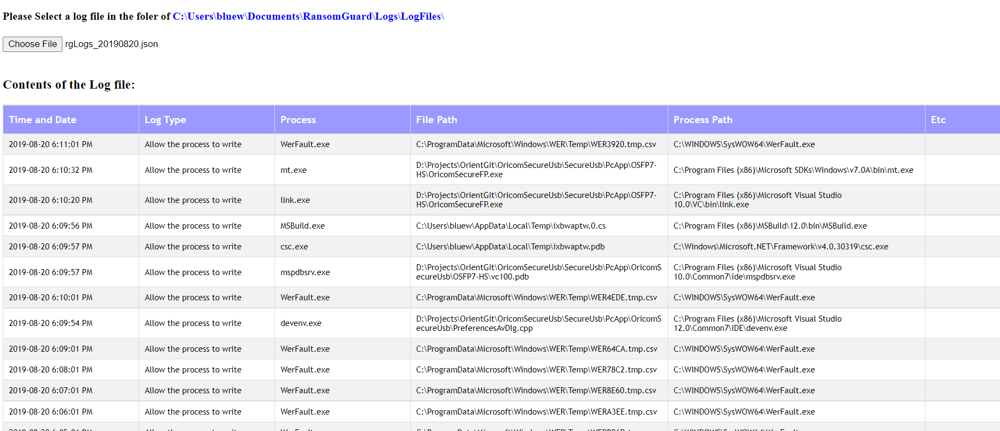
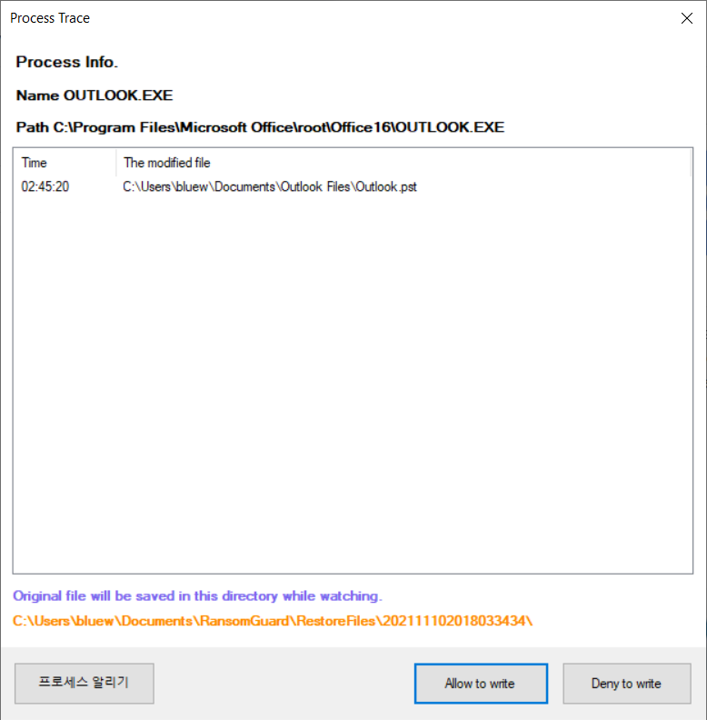

# Ransomguard
For the latest installer, you can download from [RansomGuard_v1.0.3.5.zip](https://github.com/Jamie-Kim/RansomGuard/raw/main/installer/RansomGuard_v1.0.3.5.zip).

## Introduction

Ransomguard is a specialized program designed to combat variant malware such as ransomware. It utilizes a unique method for detecting unknown threats, distinct from conventional antivirus software. By leveraging Windows Defender antivirus and a cloud-based database, it effectively identifies malicious programs while minimizing impact on the user’s PC performance, making it lighter and more efficient than traditional antivirus solutions. Ransomguard provides users with alerts regarding undetected threats, empowering them to make informed decisions. Additionally, as a cloud-based platform, it facilitates the sharing of information on trusted and malicious programs among users, enhancing collective security. Importantly, Ransomguard is free from advertisements and supports seamless uninstallation, reflecting its altruistic development purpose.

## Features

- Process and service monitoring function
- Spyware detection and treatment
- Cloud-based malware detection
- Process sandbox
- Add file extensions to protect
- Program log record
- Program self-protection
- Folder lock
- Auto update
- Remediation of detected malware
- Deleting files and folders
- Automatically Delete Trash
- File encryption and decryption
- Safe case

## Installation

1. Download the installer program (installer/RansomGuard_v1.0.3.5.zip).
2. Run the installer and follow the on-screen instructions.
3. After installation, an orange-shaped tray icon will appear in the lower right corner of your screen.

## Usage

1. Click on the tray icon to bring up the menu.
2. Use the various options provided to configure and utilize the program according to your preferences and needs.

## Spyware Detection and Settings

Ransomguard includes a feature to detect and prevent spyware. By accessing the menu, users can monitor processes using the network in real-time. Orange indicates processes that need attention, while red indicates blocked or spyware processes. Users can control process access by selecting various options from the action menu.

## Set Folder Lock

Protect important document folders from dangerous programs by setting folder locks. Once set, no process can access the specified folder without proper authorization.

## Add and Delete Extensions

Customize file protection by adding or deleting file extensions. Users can specify additional extensions for documents or files that require protection.

## Alert Settings

Configure alert settings to use cloud information by default. Users can control the level of warning windows displayed, based on their security preferences.

## Deleting Files Completely

Permanently delete files to prevent recovery. Users can select the deletion method and add files or folders for deletion.

## Manage Recycle Bin Deletion

Automatically delete files from the Recycle Bin based on specified criteria. Users can choose between normal deletion and full deletion methods.

## File Encryption

Encrypt or decrypt files with ease. Users can add files to the list, set encryption methods and passwords, and perform encryption or decryption operations.

## Safe Case

Secure portable storage devices with drive encryption. Ransomguard provides real-time encryption and decryption for files stored in the virtual drive, ensuring data security.

## Compatibility

- Windows 8.1 64-bit or higher
- Recommended: Windows 10 64-bit

## Contributing

While the source code cannot be fully open for security reasons, if you're interested in contributing to the development of Ransomguard, please contact us.

## User Interface Screenshots

